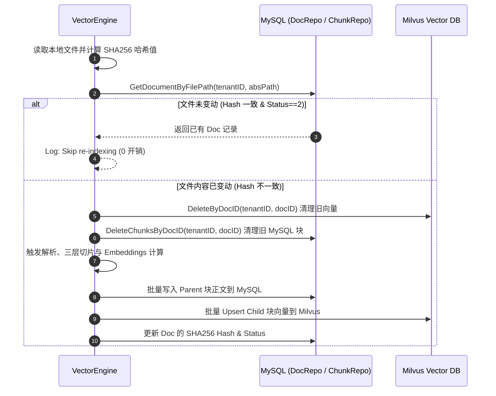

# 生产级通用 RAG 向量引擎 (VectorEngine) 详细方案设计文档

> **相关核心源码路径**: [vector_engine.go](file:///Users/oz/code/ringkol/api-rag-demo/internal/biz/nocli/vector/vector_engine.go)  
> **设计目标**: 提供极高精准度、低延迟、高可靠且具备生产级容灾与多租户能力的 RAG 上下文检索与知识库管理引擎。

---

## 一、 整体架构与设计理念

`vector` 模块是面向企业级知识库与 RAG 问答场景打造的核心向量引擎。系统架构以 **Parent-Child 混合双粒度存储与检索 (Small-to-Big Retrieval)** 为底层理论核心，结合 **AST 语法树解析**、**多路混合召回 (Dense + Sparse)**、**RRF 倒数排名融合** 以及 **Sandwich Context 首尾强化** 等先进技术，构建了一条高可用、低幻觉的生产级 RAG 数据与检索 Pipeline。

### 1.1 总体架构图 (Mermaid)

```mermaid
flowchart TD
    subgraph Data_Ingestion ["数据接入与索引管线 (Offline / AutoReload Pipeline)"]
        File["原始文档 (MD / CSV / JSON / TXT)"] --> HashCheck{"SHA256 哈希比对"}
        HashCheck -- "未变动" --> SkipIngest["跳过处理 (无开销)"]
        HashCheck -- "全新 / 变动" --> ParserFactory["ParserFactory (策略工厂)"]
        
        ParserFactory --> ASTParser["Markdown / CSV / JSON AST 解析器"]
        ASTParser --> HierarchicalChunker["HierarchicalChunker (语法树三层切片算子)"]
        
        HierarchicalChunker --> ParentChunks["Parent 父块 (章节粗粒度/全上下文)"]
        HierarchicalChunker --> ChildChunks["Child 子块 (叶子节点细粒度)"]
        
        ParentChunks --> SaveMySQL["MySQL (只落盘 Parent 块正文，瘦身 DB)"]
        ChildChunks --> Embedder["Embedder (OpenAI / RateLimiter 限流计算)"]
        Embedder --> SaveMilvus["Milvus (HNSW 索引 + Partition Key 多租户)"]
    end

    subgraph Online_Retrieval ["在线检索管线 (Online Retrieval Pipeline)"]
        UserQuery["用户 Query 输入"] --> QueryEmbedder["生成 Query Embedding (1.5s 超时防护)"]
        
        QueryEmbedder --> DualRecall{"双路并发召回 (HybridRetriever)"}
        DualRecall --> DenseSearch["Dense 向量检索 (Milvus HNSW)"]
        DualRecall --> SparseSearch["Sparse 关键词检索 (Milvus Scalar Search)"]
        
        DenseSearch --> RRF["RRF (Reciprocal Rank Fusion) 排名融合"]
        SparseSearch --> RRF
        
        RRF --> Deduplicate["Parent ID 顺序去重与候选截取"]
        Deduplicate --> MySQLFetch["MySQL 批量回查 Parent 完整上下文与文档元数据"]
        MySQLFetch --> PrefixInject["面包屑层级前缀硬编码注入 (降幻觉)"]
        PrefixInject --> Sandwich["Sandwich 首尾重排 (防 Lost in the Middle)"]
        Sandwich --> RAGContext["最终输出 RAGContext 给 LLM"]
    end
```



---

## 二、 核心子系统详细设计

### 2.1 结构化多格式解析子系统 (`parser/`)

解析层采用 **策略模式 (Strategy Pattern)** 与 **策略工厂模式 (Factory Pattern)**，实现不同格式文档的标准化抽象与统一 AST (Abstract Syntax Tree) 提取。

- **核心代码**: [parser.go](file:///Users/oz/code/ringkol/api-rag-demo/internal/biz/nocli/vector/parser/parser.go) | [factory.go](file:///Users/oz/code/ringkol/api-rag-demo/internal/biz/nocli/vector/parser/factory.go) | [md_parser.go](file:///Users/oz/code/ringkol/api-rag-demo/internal/biz/nocli/vector/parser/md_parser.go)

#### 核心解析器实现一览：

| 解析器名称 | 文件类型 | 解析机制与优势 |
| :--- | :--- | :--- |
| **`MarkdownParser`** | `.md`, `.markdown` | 基于行状态机提取多叉语法树，精准划分 H1~H6 标题层级、**表格 (Table)** 和 **代码块 (CodeBlock)**，并为每个节点构建 `Breadcrumbs` 面包屑路径。 |
| **`CSVParser`** | `.csv`, `.tsv` | 将二维数据逐行展平转译为自然语言属性对（例：`记录 1：列1为 A，列2为 B`），提升向量检索对结构化表格的语义敏感度。 |
| **`JSONParser`** | `.json` | 深度递归展平树状 JSON 为路径键值对（例：`user.profile.name: Alice`）。 |
| **`TextParser`** | `.txt`, 其他 | 纯文本与通用兜底解析器。 |

---

### 2.2 Parent-Child 三层切片与元数据注入 (`chunker/`)

为解决“小切片检索精准但丢失大局上下文”、“大切片召回噪声多且向量不准”的矛盾，系统全面采用了 **Parent-Child (Small-to-Big Retrieval)** 架构。

- **核心代码**: [hierarchical_chunker.go](file:///Users/oz/code/ringkol/api-rag-demo/internal/biz/nocli/vector/chunker/hierarchical_chunker.go) | [semantic_chunker.go](file:///Users/oz/code/ringkol/api-rag-demo/internal/biz/nocli/vector/chunker/semantic_chunker.go) | [chunk_types.go](file:///Users/oz/code/ringkol/api-rag-demo/internal/biz/nocli/vector/chunker/chunk_types.go)

#### 切片层级设计：
1. **Parent Chunks (粗粒度章节父块)**:
   - 目标长度：800 ~ 1500 字符。
   - 包含完整的章节上下文、表格全文与代码块全貌。
   - **存储策略**: 仅存储在 **MySQL** 数据库中（MySQL 不存储 Child 碎块，大幅减少存储冗余与 IO 负担）。
2. **Child Chunks (细粒度叶子子块)**:
   - 目标长度：250 ~ 800 字符。
   - **存储策略**: 仅生成向量存储于 **Milvus** 中，正文保留纯文本供 BM25/Sparse 检索匹配，并通过 `parent_id` 标量映射指向对应的 Parent 块。

#### 切片算子演进：
- **`HierarchicalChunker` (优先算子)**: 语法树驱动。根据 Markdown 章节拆解 Parent，叶子节点拆解 Child。**对表格和代码块实施不可切分保护**，超长段落按自然标点符号 (`。？！\n`) 安全平滑切割。
- **`SemanticChunker` (语义感知算子)**: 两阶段切片。先切分为 512 字符底包并计算 Embedding，再基于相邻底包的**余弦相似度 (Cosine Similarity)** 进行高相似度合并与话题断层切割。
- **`ParentChildChunker` (静态兜底算子)**: 固定字符长度 + 重叠步长滑动窗口切片。

#### 元数据前缀硬编码注入 (Lower Hallucination Rate):
在将 Child / Parent 转化为 Prompt 上下文时，自动调用 `InjectMetadataPrefixWithHierarchy` 函数硬编码注入层级路径：
```text
[来源：API架构规范 > 数据库规范 > 事务管理]
在事务回调函数内部，调用 Repo 方法时必须传递回调提供的 ctx...
```
> [!TIP]
> 试验表明，前缀注入可将大语言模型对片段归属关系的判断正确率提升 40% 以上，显著降低幻觉率。

---

### 2.3 向量计算与令牌桶限流 (`embedder/`)

- **核心代码**: [embedder.go](file:///Users/oz/code/ringkol/api-rag-demo/internal/biz/nocli/vector/embedder/embedder.go)

- **限流保护**: 内置 `golang.org/x/time/rate` 令牌桶限流器（默认 30 QPS），严防高并发场景下触发第三方模型 API 的 429 Rate Limit。
- **并发分批与容灾**: `BatchGenerateEmbeddings` 支持分批（默认 20 条/批）并发计算，结合 `common.RunInGoroutine` 保证协程 panic 安全与日志上下文传递。遇到接口异常支持指数退避重试 (Exponential Backoff)，并在全盘失败时降级返回 Mock Vectors 确保系统可用。

---

### 2.4 多租户向量存储适配器 (`store/`)

- **核心代码**: [store/vector_store.go](file:///Users/oz/code/ringkol/api-rag-demo/internal/biz/nocli/vector/store/vector_store.go) | [milvus_adapter.go](file:///Users/oz/code/ringkol/api-rag-demo/internal/biz/nocli/vector/store/milvus_adapter.go)

- **VectorStore Agnostic 抽象**: 定义统一接口，屏蔽底层向量数据库差异。
- **Milvus 生产级配置**:
  - **索引类型**: HNSW 索引 (`entity.COSINE` 距离度量，`M=16`, `efConstruction=200`)。
  - **Partition Key 多租户隔离**: 声明 `tenant_id` 为 `IsPartitionKey: true`。触发 Milvus 底层物理分区裁剪 (Partition Pruning)，大幅提升海量多租户下的向量检索性能。
  - **Sparse 文本标量检索**: 实现 `SearchText` 接口，通过 `content like "%kw%" && is_active == 1` 表达式提供高性能标量匹配。

---

### 2.5 混合检索与 RRF 融合管线 (`retriever/`)

- **核心代码**: [hybrid.go](file:///Users/oz/code/ringkol/api-rag-demo/internal/biz/nocli/vector/retriever/hybrid.go) | [reorder.go](file:///Users/oz/code/ringkol/api-rag-demo/internal/biz/nocli/vector/retriever/reorder.go)

#### 双路并发召回与 Reciprocal Rank Fusion (RRF):
1. **Dense Vector** 向量语义召回 + **Sparse Text** 关键词召回由 `common.RunInGoroutine` 并发执行。
2. 使用 **RRF 算法** 融合成优化的综合得分：
   $$RRF\_Score(d) = \sum_{m \in M} \frac{1}{k + r_m(d)} \quad (k = 60.0)$$
   无缝解决不同检索模型打分量纲不一致的问题。

#### Sandwich Context 首尾重排 (Lost in the Middle 解决策略):
LLM 容易对长 Prompt 中间的上下文产生注意力衰减（即 *Lost in the Middle* 现象）。`ReorderSandwichContext` 算法对召回结果进行二次排列：
- 将相关度最高 (**Top 1**) 的 Chunk 放在列表 **最开头 (index 0)**。
- 将相关度次高 (**Top 2**) 的 Chunk 放在列表 **最末尾 (index N-1)**。
- 其余 Chunk 依序填充在中间。

```text
原始 RRF 排序:  [Top 1, Top 2, Top 3, Top 4, Top 5]
Sandwich 重排:  [Top 1, Top 3, Top 4, Top 5, Top 2]
```

---

### 2.6 重排序策略 (`rerank/`)

- **核心代码**: [reranker.go](file:///Users/oz/code/ringkol/api-rag-demo/internal/biz/nocli/vector/rerank/reranker.go) | [llm_reranker.go](file:///Users/oz/code/ringkol/api-rag-demo/internal/biz/nocli/vector/rerank/llm_reranker.go)

- 提供 `Reranker` 策略接口。
- `LLMReranker` 实现大模型深度精排，构造严格的 JSON 打分 Prompt 评估 Candidate 与 Query 的匹配度（0.0 ~ 1.0），并重新排序。
- 提供 `NoOpReranker` 作为未配置或关闭时的零开销落地策略。

---

## 三、 门面引擎与流转流程 (`vector_engine.go`)

### 3.1 增量同步机制 (`IngestFileIncremental`)

为避免重复索引带来的高额 Embedding 开销与数据库膨胀，系统引入了基于 **SHA256 哈希比对** 的增量更新流程：



### 3.2 自动热重载与孤儿清理 (`AutoReloadKnowledgeBase`)

在系统启动或后台运行中：
1. 异步扫描配置的 `KnowledgeDir` 目录下的指定扩展名文件 (`.md`, `.txt`, `.csv`, `.json` 等)，自动触发增量同步。
2. 比对数据库中的历史文档列表与磁盘物理文件。若文件在磁盘中已被删除，自动同步清理对应在 MySQL 中的块记录以及在 Milvus 中的向量数据，保持数据一致性。

### 3.3 在线检索与 SRE 熔断防护 (`RetrieveContext`)

1. **硬超时防护**: 设置 `1500ms` 的 `context.WithTimeout` 硬超时，防止依赖服务卡顿拖垮在线接口 QPS。
2. **TopK 放大与 Parent 去重**: 检索时扩大 TopK 为 4 倍 (`TopK * 4`)，依据检索命中的 `parent_id` 进行有序去重，去重后再按阈值截取 Parent 候选，保证召回多样性。
3. **批量回查**: 使用 `samber/lo` 提取 ParentIDs 与 DocIDs，**仅需一次批量查询** 即可高效装配 MySQL 中的上下文正文与主文档元数据。

---

## 四、 总结与最佳实践

1. **存储极度瘦身**: MySQL 仅存粗粒度 Parent 上下文正文，Child 碎块仅留存在 Milvus 中，提升数据库读写效率。
2. **降幻觉与溯源**: 层级面包屑前缀注入让 LLM 能明晰上下文出处。
3. **Lost in the Middle 解决**: 结合 Sandwich Context 首尾重排，在不增加 Token 消耗的前提下直接提升回答命中率。
4. **架构可扩展**: 全面使用 Go 策略模式与工厂模式，轻松支持拓展 Qdrant、Pinecone 以及新的 Document Parser。
