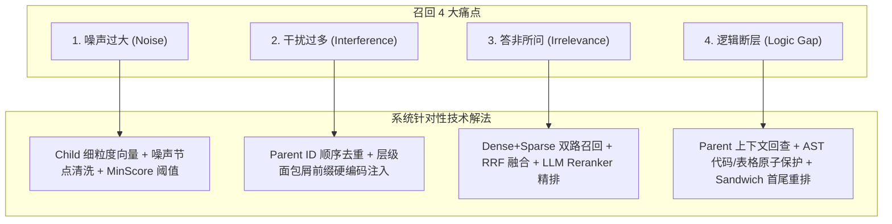
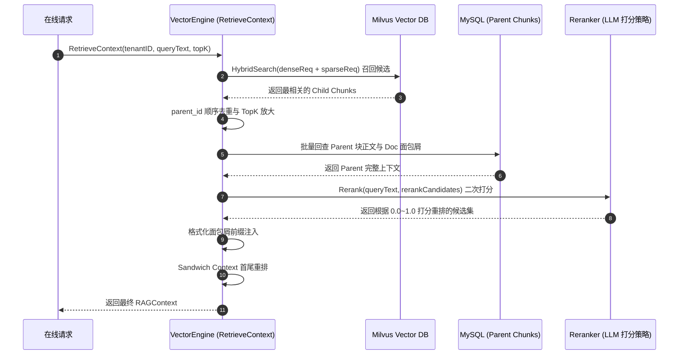

# RAG 向量引擎 (VectorEngine) 硬核技术细节与面试高频考点手册

> 本手册专为技术面试准备，总结了 `internal/biz/nocli/vector` 模块中涉及的核心算法、设计模式、数据库优化及高可用工程落地细节。（**注：内容持续累加中**）

---

## 专题一：如何解决 RAG 召回的 4 大痛点（干扰过多、噪声过大、答非所问、逻辑断层）

在实际生产场景中，RAG 最常面临以下 4 大检索质量瓶颈。本引擎通过多层 Pipeline 的协同设计，针对性地给出了工程与算法上的解法：

### 1. 噪声过大 (High Noise)
- **技术解法**:
  1. **Child 细粒度向量检索 (250~800 字符)**: 向量检索层使用小 Chunk，语义集中，精准捕捉局部特征，大幅降低索引库中的噪音干涉。
  2. **语法树节点噪声清洗 (`isIgnoredNoiseNode`)**: 在 AST 解析和切片阶段，自动过滤纯符号段落、连续分割线 (`***`, `---`, `___`) 与空节点。
  3. **`MinScore` 相似度门槛过滤**: 硬性设置最低得分阈值（如 `ScoreThreshold > 0.1`），阻断低相关度切片。

### 2. 干扰过多 (Excessive Interference)
- **技术解法**:
  1. **`parent_id` 顺序去重与 TopK 放大**: 向量检索扩大 TopK 为 4 倍 (`TopK * 4`)，再**基于 `parent_id` 有序去重**，确保同一父章节只被引入一次，杜绝冗余碎块干扰，提高召回多样性。
  2. **面包屑层级前缀硬编码注入 (`InjectMetadataPrefixWithHierarchy`)**: 在 Context 前强制注入 `[来源：API规范 > 数据库规范 > 事务管理]` 前缀，消除跨章节切片的语义混淆。

### 3. 答非所问 (Irrelevance / Off-topic)
- **技术解法**:
  1. **Dense + Sparse 双路并发召回**: Dense 向量负责语义泛化，Sparse 关键词（Milvus 标量过滤）精准拦截专有名词、错误码与型号。
  2. **RRF 倒数排名融合**: 使用公式 $RRF\_Score(d) = \sum \frac{1}{k + r(d)}$ 融合成综合得分。
  3. **LLM Reranker 深度二次打分**: 大模型以 0.0 ~ 1.0 的标尺二次打分重排，过滤伪相关切片。

### 4. 逻辑断层 (Logic Gaps / Context Loss)
- **技术解法**:
  1. **Parent 粗粒度上下文回查 (Context Reconstruction)**: 命中的 Child 块通过 `parent_id` **批量回查 MySQL 中完整的 Parent 章节 (800~1500 字符)** 送给 LLM，保留完整因果链。
  2. **Markdown AST 表格/代码块不可切分保护 (`HierarchicalChunker`)**: 将表格与代码块标记为 **Atomic Unit (原子单元)**，强行禁止切断。
  3. **Sandwich Context 首尾重排算法 (`ReorderSandwichContext`)**: 将 **Top 1** 切片置于 Prompt 最开头，**Top 2** 置于最末尾，其余置于中间，解决 Lost in the Middle 效应。

---

## 专题二：全套核心架构与技术细节速查

- Parent-Child (MySQL仅存Parent)，SemanticChunker 512底包，RRF ($k=60.0$)，Sandwich Context，Milvus Partition Key 多租户，SHA256 增量。

---

## 专题三：Chunk 切分大小设计与 Overlap 重叠步长的深度考量

- Child Max 800 字，基于 AST 标点；Static Overlap 12% ($30/250$) 黄金比例。

---

## 专题四：SemanticChunker 语义感知切割原理

- 依据 Cosine 相似度决定切分边界而非字数，解决词频过度切割。

---

## 专题五：BM25 与向量距离度量 (Cosine/L2/IP) 全解

- BM25 结合 TF 词频饱和度与文档长度归一化。归一化后 $\text{Cosine} = \text{IP}$。

---

## 专题六：本项目 (VectorEngine) 技术选型清单

- 距离度量: Cosine
- 向量索引: HNSW (M=16, efConstruction=200)
- 召回: Dense + Sparse 双路并发召回
- 融合: RRF 倒数排名融合 ($k=60.0$)
- 重排: LLM Reranker + Sandwich Context 首尾重排
- 存储与优化: Milvus Partition Key + MySQL 瘦身 (仅存 Parent)

---

## 专题七：为什么不独立引入原生的 BM25 集群？

- 避免 MySQL + Milvus + ES 多组件分布式双写一致性危机，避免 CGO 开销，极简架构。

---

## 专题八：ByteDance Eino 框架中 BM25 的实现原理与对比

- 范式 A: 内存型纯 Go 倒排索引 (`map[string][]Posting`)；范式 B: 向量数据库服务端代理。

---

## 专题九：如何适配 Milvus 2.4+ Native BM25 与 HybridSearch（包含 `denseReq` 与 `sparseReq`）

- 使用 `milvusclient.ANNSearchRequest` 组装 `denseReq` 与 `sparseReq`，并发起原生 `HybridSearch`。

---

## 专题十：代码重构与架构演进记录（双模式并存）

- [hybrid.go](file:///Users/oz/code/ringkol/api-rag-demo/internal/biz/nocli/vector/retriever/hybrid.go): 主力 Milvus 原生 `HybridSearch`；
- [hybrid_manual_rrf.go](file:///Users/oz/code/ringkol/api-rag-demo/internal/biz/nocli/vector/retriever/hybrid_manual_rrf.go): 保留 Go 客户端并发 RRF 代码。

---

## 专题十一：Reranker 精排的真实集成位置与链路补全记录

您做出的判断非常敏锐：在 `VectorEngine` 构造函数中虽然初始化了 `reranker := rerank.NewReranker(cfg)`，但早期的 `RetrieveContext` 编排管线中漏掉了调用逻辑。

我们在 [vector_engine.go#L538](file:///Users/oz/code/ringkol/api-rag-demo/internal/biz/nocli/vector/vector_engine.go#L538) 中完成了 **Reranker 精排链路的补全与集成**：

### 完整的 RAG 检索管线 (Sequence & Pipeline):

